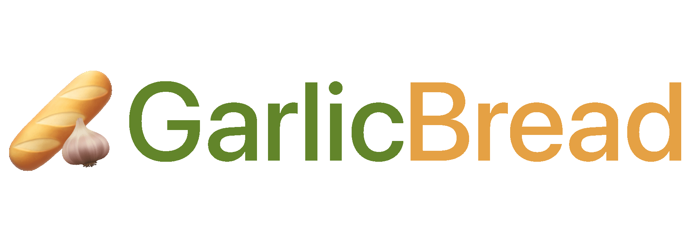

<div align="center">
  <div>&nbsp;</div>
   
</div>

## Introduction

Garlic Bread is a _fun_, _simple_ and _useful_ bot written using `Discord.JS`. It has some features that I needed for my guild. This bot is designed for casual, simple guilds.

## Features

1. Customizable roles
2. Dice rolling
3. Random Kanye quotes
4. Moderation tools
5. Remote maintenance

... and more useful tools like 'userinfo' and 'avatar'.

## Getting Started

1. Clone the repo:

```sh
git clone https://github.com/VladCuciureanu/GarlicBread.git
```

2. Duplicate the .env template:

```sh
cp .env .env.local
```

3. Set the appropriate value for the environment variables inside:

```js
DISCORD_TOKEN=CENSORED
TENOR_TOKEN=CENSORED
OWNERS=405688243292733440
DATABASE_URL="file:./dev.db"
```

4. Build the source code:

```sh
npm build
```

5. Run the following command and enjoy!

```sh
npm start
```

## License
GarlicBread is distributed under the terms of the MIT License. Free for both commercial and research use.